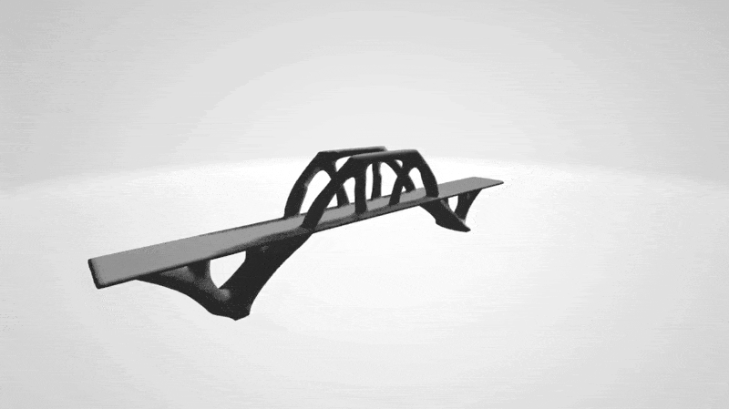

# topo-fenics
This repository contains a simple 55 line code written in python for 2D and 3D  to carry out large-scale parallel Topology Optimization using the open-source package FEniCS. 



## Abstract

This paper presents a 55-line code written in python for 2D and 3D topology optimization based on the open-source finite element computing software (FEniCS), equipped with various finite element tools and solvers. PETSc is used as the linear algebra back-end, which results in significantly less computational time than standard python libraries. The code is designed based on the popular solid isotropic material with penalization (SIMP) methodology. Extensions to multiple load cases, different boundary conditions, and incorporation of passive elements are also presented. Thus, this implementation is the most compact implementation of SIMP based topology optimization for 3D as well as 2D problems.

```
@article{gupta55lineCodeLargescale2020,
title = {A 55-Line Code for Large-Scale Parallel Topology Optimization in {{2D}} and {{3D}}},
author = {Gupta, Abhinav and Chowdhury, Rajib and Chakrabarti, Anupam and Rabczuk, Timon},
year = {2020},
doi = {https://doi.org/10.48550/arXiv.2012.08208},
journal = {arXiv preprint arXiv:2012.08208},
}
```


Detailed explanation could be found [here](https://www.researchgate.net/publication/347300347_A_55-line_code_for_large-scale_parallel_topology_optimization_in_2D_and_3D).

